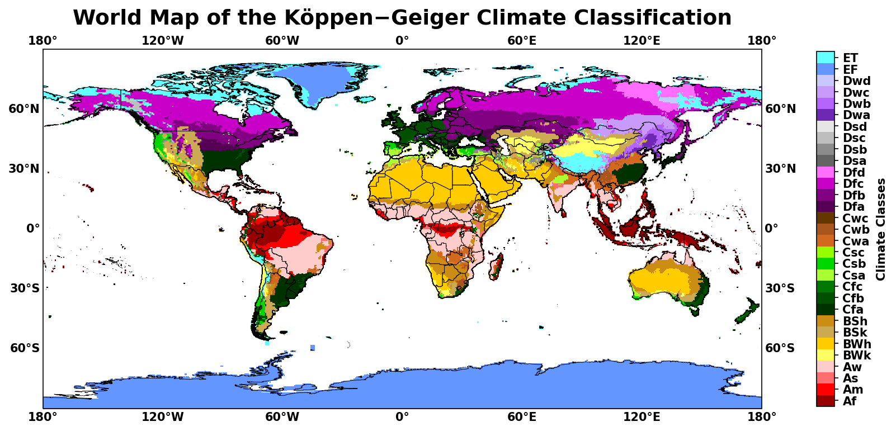
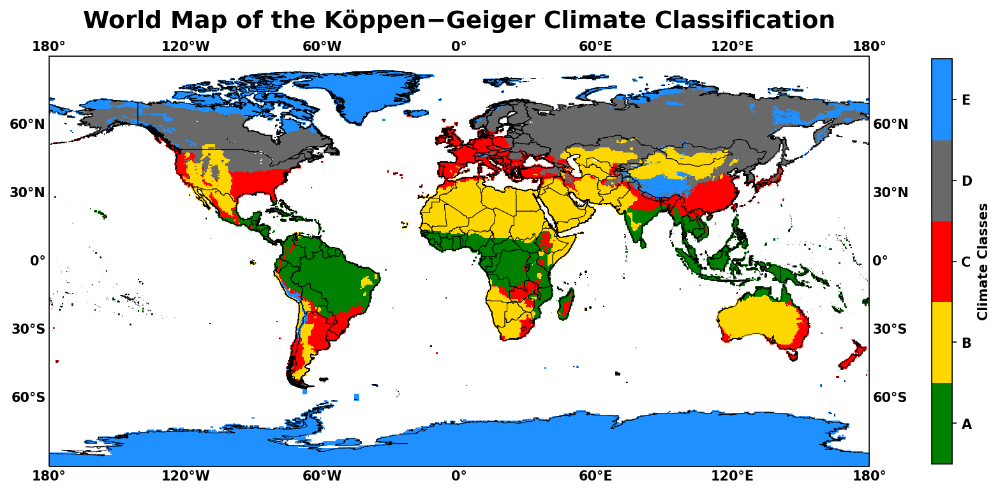
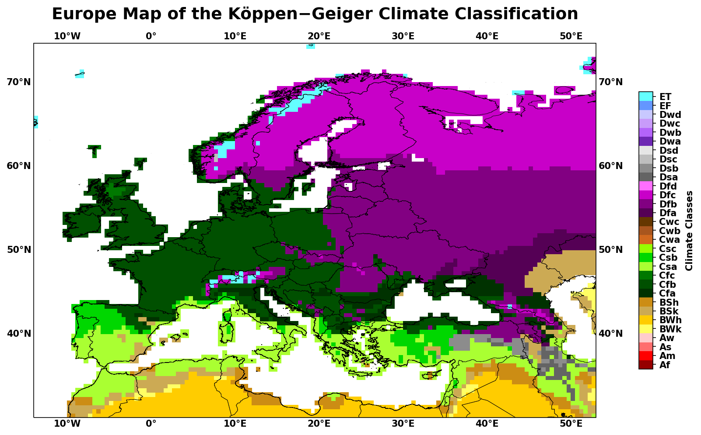

### The code provides regionally and globally maps of Koppen-Geiger climate classification scheme.
### The maps are divided into two categories:
* Fine resolution including all 32 climate classes
* Coarse resolution including the 5 mains climate classes

## Data Requirements

### The Koppen-Geiger climate classification system data at 0.5°x0.5° spatial resolution can easily be downloaded from: http://koeppen-geiger.vu-wien.ac.at/present.htm
### The shape file used in the code can be easily be downloaded from: https://gadm.org/data.html

## Examples
### Worldwide map for fine climate resolution

### Worldwide map for coarse climate resolution

### Worldwide map of climate classification for Europe at finec limate resolution

